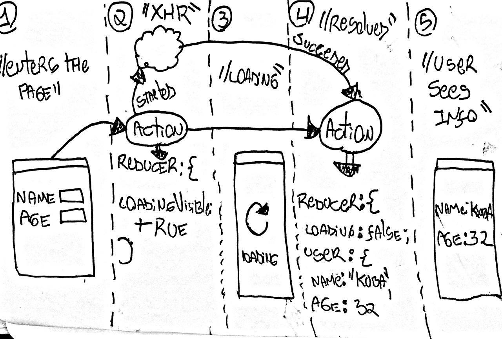

# Guidelines

Hey there, I am a set of guidelines, make sure to consider me.

## XHR Using [redux-pack](https://github.com/lelandrichardson/redux-pack).

Redux applications come with a intrinsic problem, which is asynchronicity (impure functions, side effects).
In order to deal with this issue, you may choose to implement a rather verbose and tedious set of actions,
say one per request lifecycle.

e.g.
- `dispatching a *requestStarted* action when calling a browser fetch()`
- `dispatching another *requestSucceeded* action when it gets resolved`
- `OR possibly dispatching a *requestFailed* action if it gets rejected`

All of that comes with its corresponding *react-redux* boilerplate, i.e. actionCreators, unittests, maybe a thunk...
Therefore you might come to the conclusion that it would be better to use some lib to encapsulate that, I the guideline, 
would agree with you, person.

In a happy scenario where you did your job right, most of this async actions would be simple XHR, consider the following example:

1 - You enter an user details page, something with your name and other date on it. Assuming that there is no cache and the page isn't served with SSR,
you would at first see an empty page OR a placeholder, after all your data isn't there yet.

2 - A XHR Request is made in order to retrieve a json payload with the user data.

3 - The page changes, not it shows a loading animation.

4 - The requet gets resolved successfully and your json gets parsed into the store.

5 - The animation disappear and finally your user data is drawn instead.





This is a perfec example of where you should use redux-pack, if you do it from scratch without the aid of any mechanism, steps 2 and 4 would have to be manually dispatched inside the XHR promise flow, Add an extra dispatch if you want to handle errors. Redux-pack lets you do all of this within ONE SINGLE redux action dispatch.

### Implementation without redux-pack

**reducer.js**

```
const initialState = fromJS{
    requestAnimationVisible: false,
    errorVisible: false,
    errorMessage: "",
    user: {
        name: "",
        age: 0,
        preferredCountry: "Poland"
    }
};

const reducer = (state = initialState, action) => {
    switch(action.type) {
        case "FETCH_USER_DATA_STARTED":
            return state.merge({
                requestAnimationVisible: true,
                errorVisible: false,
                errorMessage: ""
            });
            break;

        case "FETCH_USER_DATA_SUCCEEDED":
            return state.merge({
                requestAnimationVisible: false,
                errorVisible: false,
                errorMessage: "",
                user: action.user
            });
            break;

        case "FETCH_USER_DATA_FAILED":
            return state.merge({
                requestAnimationVisible: false,
                errorVisible: true,
                errorMessage: action.errorMessage
            });
            break;

        default: return state;
    }
}
```

**action.js**

```
// Pure js objects
const fetchUserData_started = () => ({
    type: "FETCH_USER_DATA_STARTED"
}); 

const fetchUserData_succeeded = (payload) => ({
    type: "FETCH_USER_DATA_SUCCEEDED",
    userData: payload
}); 

const fetchUserData_failed = (error) => ({
    type: "FETCH_USER_DATA_FAILED",
    errorMessage: error
}); 

// thunk
const fetchUserData = (userId) => (dispatch) => {
    //first dispatch a 'started action', so the UI can know it is supposed to render the loading animation.
    dispatch(fetchUserData_started());

    // Make the actual request. e.g. browser.fetch api
    request(`myapi.com/userdata/${userId}`)
        .then((payload) => {
            // It worked, so we send it to the store.
            dispatch(fetchUserData_succeeded(payload));
        })
        .catch((error) => {
            // The request failed for some reason, we might want to send the error to the store so we can show
            // some custom error dialog to the user.
            dispatch(fetchUserData_failed(error));
        });
}
```
### Implementation with redux-pack

**action.js**

```
const fetchUserData = (userId) => ({
    type: "FETCH_USER_DATA",
    promise: request(`myapi.com/userdata/${userId}`)
}); 
```

**reducer.js**

```
import { handle } from 'redux-pack';

const reducer = (state = initialState, action) => {
    switch(action.type) {
        case "FETCH_USER_DATA":
            return handle(state, action, {
                start: (prevState) => state.merge({
                    requestAnimationVisible: true,
                    errorVisible: false,
                    errorMessage: ""
                }),

                failure: (prevState) => state.merge({
                    requestAnimationVisible: false,
                    errorVisible: true,
                    errorMessage: action.errorMessage
                }),

                sucess: (prevState) => state.merge({
                    requestAnimationVisible: false,
                    errorVisible: false,
                    errorMessage: "",
                    user: action.user
                }),
            });
            break;

        default: return state;
    }
}
```

As we can see, the actions.js file is MUCH SIMPLER when we are using redux-pack, you are more than welcome to check out the official [documentation](https://github.com/lelandrichardson/redux-pack).